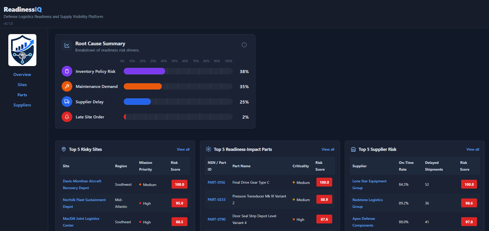
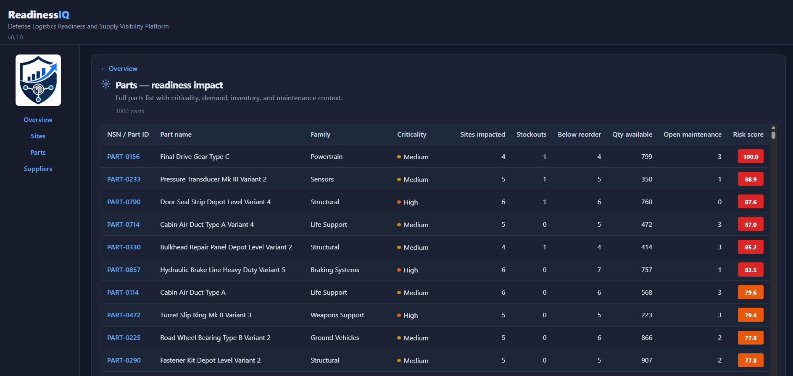

# ReadinessIQ

Logistics readiness API: inventory, shipments, maintenance, and supplier-style synthetic data surfaced through KPIs, site risk ranking, and part-level impact.


## What it does

ReadinessIQ helps answer:

- Which sites are at greatest readiness risk?
- Which parts are driving readiness impact?
- Which suppliers are associated with delays or backlog?
- What root-cause signals are contributing most to readiness risk?
- What should a logistics or sustainment manager review first?

## Tech stack

- Frontend: React, Vite, TypeScript, React Router
- Backend: FastAPI, SQLAlchemy, Alembic
- Database: PostgreSQL
- Auth: bcrypt password hashing, HttpOnly session cookies, TOTP MFA (pyotp)
- Data workflow: Pandas synthetic data generation, validation, CSV-to-Postgres loading
- Testing: Pytest, Vitest, Testing Library
- DevOps: Docker Compose, GitHub Actions

## Screenshots

### Dashboard overview



### Full ranking view



## Quick start

1. **Environment** — Copy `.env.example` to `.env` and set `POSTGRES_*` / `DATABASE_URL` (see `docker-compose.yml` for variable names).

2. **Database** — From the repo root:

   ```bash
   docker compose up -d postgres
   ```

3. **Backend (local)** — Python 3.12+ recommended.

   ```bash
   python3 -m venv .venv
   source .venv/bin/activate
   pip install -r backend/requirements.txt
   ```

4. **Auth tables** — Run Alembic migrations against Postgres (required for register/login/MFA):

   ```bash
   cd backend
   python -m alembic upgrade head
   ```

5. **Load data** — Generate CSVs under `data/raw/` (optional), then load into Postgres:

   ```bash
   python3 backend/scripts/generate_synthetic_data.py
   python3 backend/scripts/load_csv_to_postgres.py
   ```

6. **Run API** — From `backend/`:

   ```bash
   cd backend
   uvicorn app.main:app --reload --host 0.0.0.0 --port 8000
   ```

   Open **http://localhost:8000/docs** for Swagger.

**Docker (full stack)** — Rebuild after code changes:

```bash
docker compose up -d --build
```

This starts Postgres, the API on **:8000**, and the frontend on **:5173**.

## Frontend

The **Vite + React** app under `frontend/` provides the operator UI:

- **Overview** (`/`) — Root cause summary (risk-driver **share of total signals** as horizontal bars), plus **Top 5** cards for sites, parts, and suppliers.
- **View all** — Each Top 5 card links to a full ranking: **`/sites`**, **`/parts`**, **`/suppliers`**. These routes render the shared **`ViewAll`** template (`frontend/src/components/viewAll.tsx`): larger card, sticky table header, scrollable grid, and **all columns** from the API via `riskRankingViewModel.ts` (Top 5 uses a slim column subset).
- **Entity detail** — Drill-down routes such as `/sites/:siteId`, `/parts/:partId`, `/suppliers/:supplierId`.
- **Navigation** — `react-router-dom` with `NavLink` in the sidebar; client-side table links use the same router.
- **API base URL** — Optional `VITE_API_BASE_URL` (defaults to `http://localhost:8000`); align with the backend when not using the Vite proxy.

From `frontend/`:

```bash
npm install
npm run dev          # http://localhost:5173
npm run test         # Vitest + Testing Library
npm run lint         # ESLint
npm run build
```

See **`frontend/README.md`** for more detail.

## Authentication

The dashboard shell is always reachable, but **readiness data is protected** until you sign in.

| Route | Purpose |
|-------|---------|
| `/login` | Sign in with email and password |
| `/register` | Create an account (auto-login with session cookie) |
| `/mfa` | Set up or verify MFA |

### Session flow

- Login and register set an HttpOnly `session_id` cookie (`credentials: 'include'` on frontend fetches).
- `GET /api/me/` returns the current user and MFA status.
- `POST /api/logout/` clears the session.

### MFA (optional enrollment, required when enabled)

- **First-time setup is optional** — after login you can go straight to the dashboard, or open **Set up MFA** in the sidebar (or visit `/mfa`).
- On `/mfa`, scan the QR code or copy the **manual secret** into an authenticator app, then enter a 6-digit code to enable MFA.
- **Skip for now** or **Back to dashboard** returns to the overview without enabling MFA.
- Once MFA is enabled, each login requires a TOTP code before the dashboard unlocks.

### Auth API endpoints

| Method | Path | Description |
|--------|------|-------------|
| `POST` | `/api/register_user/` | Register a user |
| `POST` | `/api/login/` | Login, set session cookie |
| `POST` | `/api/logout/` | Logout, clear cookie |
| `GET` | `/api/me/` | Current user (`mfa_enabled`, `mfa_verified`) |
| `GET` | `/api/mfa/setup/` | QR / secret provisioning (authenticated) |
| `POST` | `/api/mfa/verify/` | Verify TOTP and mark session MFA-verified |

## Tests

From the repo root (uses `pytest.ini`):

```bash
pytest
```

Frontend unit tests run in **`frontend/`** with `npm run test` (see **Frontend** above). GitHub Actions runs **pytest**, **Vitest**, **ESLint**, and a production build in `.github/workflows/test.yml`.

## Layout (high level)

```
ReadinessIQ/
├── backend/app/          # FastAPI app, routers, models
├── backend/alembic/      # Database migrations (users, sessions)
├── backend/scripts/      # Synthetic data + CSV loader
├── backend/tests/
├── backend/utils/        # Password hashing, sessions, MFA helpers
├── frontend/             # Vite + React UI (routing, auth, Top 5, View all)
├── data/raw/             # Generated CSVs (gitignored patterns may apply)
├── docker-compose.yml
└── backend/Dockerfile
```

## API highlights

### Health & KPIs

- `GET /health` — verifies API and database connectivity
- `GET /api/kpis/overview` — inventory, shipment, and maintenance KPIs
- `GET /api/sites/risk-ranking` — ranks sites by readiness risk
- `GET /api/sites/{site_id}/summary` — site-level drill-down
- `GET /api/parts/readiness-impact` — ranks parts by readiness impact
- `GET /api/suppliers/risk-ranking` — ranks supplier-associated risk
- `GET /api/root-cause/readiness-risk` — summarizes readiness root-cause signals

### Auth

- `POST /api/register_user/` — register user
- `POST /api/login/` — login
- `POST /api/logout/` — logout
- `GET /api/me/` — current user
- `GET /api/mfa/setup/` — MFA enrollment setup
- `POST /api/mfa/verify/` — verify MFA code
